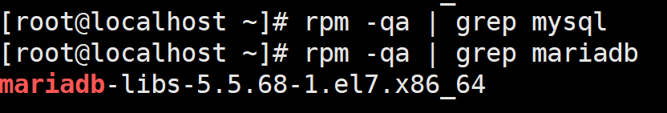

> linux安装mysql 以debian为例

查看是否安装MySql
```shell
rpm -qa | grep mysql
```
查看是否安装mariadb
```shell
# 如果是 CentOS7 可以检测出已经安装了 mariadb
rpm -qa | grep mariadb
```


移除相关软件
```shell
rpm -e --nodeps mariadb-libs-5.5.68-1.el7.x86_64
```

一、安装Mysql

[下载mysql](https://dev.mysql.com/downloads/mysql/)
